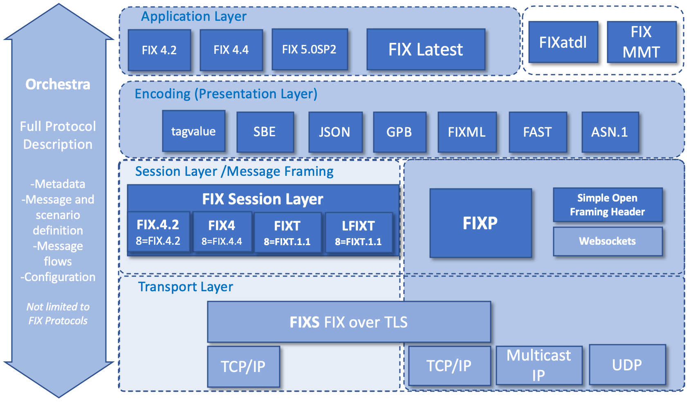
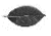
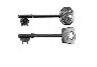
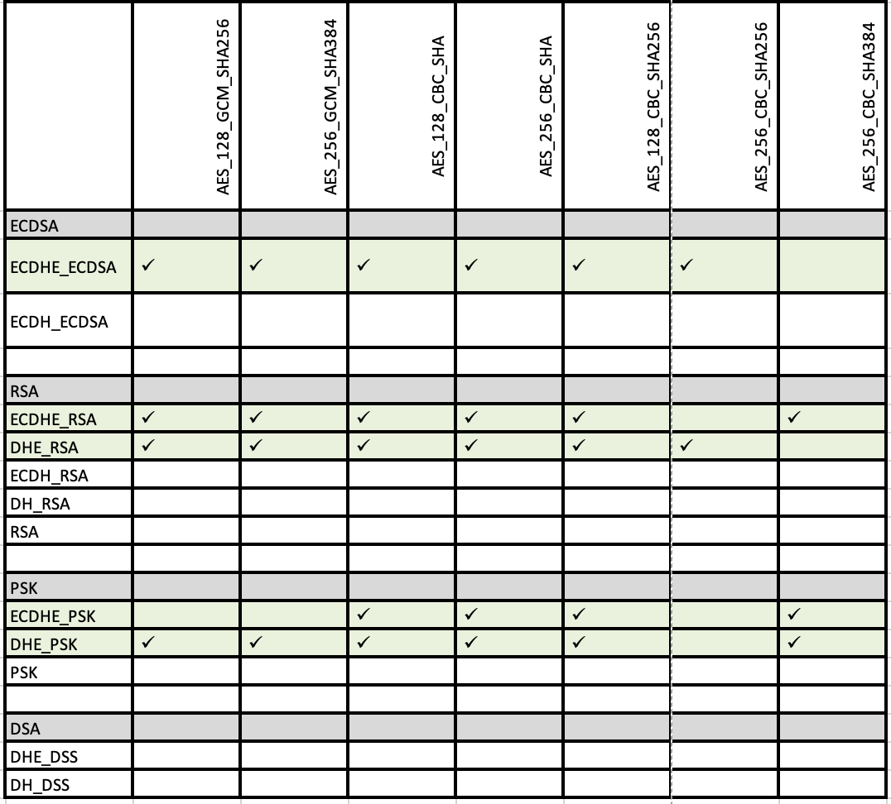

# Introduction

FIX-over-TLS (FIXS) is a technical standard that specifies how to use the Transport Layer Security (TLS) protocol with FIX. It provides standardization to ensure interoperability and that a minimum level of security is applied. We believe FIXS will make it easier for FIX participants to employ TLS and hope that this will help to improve security across the industry. TLS is also sometimes referred to as its now-deprecated predecessor, Secure Sockets Layer (SSL).

TLS is a rich and evolving protocol with many features and options. The protocol, for example, allows for new security functions to be added and vulnerable functions to be dropped. Additionally, information security is wide and varied. Understanding the TLS protocol features and options is complex and time-consuming, and incorrect configuration or management of TLS can result in insecure linkage or no security at all. The FIXS standard, therefore, aims to make employing TLS simpler and further provides guidance and best practice that is valid at the time of writing.

FIXS is primarily focused on how TLS can be used reliably, with a minimum level of standardization, across the FIX community. The standard first concentrates on possible methods to authenticate the parties connecting to one another. It then goes into the different aspects of each authentication method as well as the different protocol options and what is recommended. This includes the different available cipher suites as well as certificate properties and validation.

FIXS optionally includes authentication of clients as part of the FIX session i.e. within the TLS tunnel. This is termed FIX Authentication (FIXA) and it can be used to authenticate FIX clients at the FIX session level rather than at the TLS level.

FIXS does not prevent participants from using additional security controls. FIXS defines a minimum set of requirements, which are needed for common use cases and interoperability. Participants may choose to use security controls beyond what is specified in FIXS for extra security or to address the latest vulnerabilities.

Security is only one aspect of using TLS. Another aspect is performance, and a further consideration is compatibility with out-of-band monitoring solutions. We therefore try to balance security with the needs of performance and compatibility, in order to keep FIXS suitable for trading and other activities within banking and finance.

This is an evolving standard, adapting as we learn and as the technologies involved themselves grow and evolve. As always, we welcome your feedback and hope that you will share your views with us.

## Scope

This standard is targeted at companies wanting to secure FIX sessions generally, whether FIX is being run over the public Internet, across other networks or internally within a firm.

We hope to address general concerns about performance through proof-of-concepts. FIXS is not yet intended to be a substitute for other security controls in ultra-low latency environments.

This standard focuses on the use of TLS within the context of FIX, independent of any particular system. We have a separate document for guidance on the open source Stunnel program. We also refer to some implementations in this standard when clarifying support for particular options. However, the aim of this document is not to go into the detail of TLS implementations.

This standard covers the use of TLS to protect application and session-level communications exposed by FIX session protocols. Specifically, by \"sessions-level communications\" we refer to the communication between FIX initiator and FIX acceptor over a TCP/IP socket. This standard does not consider the use of TLS or other security protocols such as IPSec for router-to-router or virtual private network (VPN) communications; nor does it consider other protocols such as IPSec for application-level security. Additionally, this standard does not address other FIX message transports such as AMQP, IBM WebSphere MQ or multicast UDP.

A notable point about site-to-site VPNs between routers or firewalls using IPSec and perhaps TLS/SSL is that connections can be two-way. That is to say either side can connect to the other (i.e. acting as client or server), and maybe both can be connected to the other at the same time (i.e. each side acting as both client and server simultaneously). However, in this guide, we are only concerned with a one-way connection from the FIX initiator to the FIX acceptor.

This document is not intended to be a complete guide to TLS. Instead, there are many publicly available resources on the Internet which provide in-depth information on TLS/SSL. We have provided links to a number of these resources at the end of this document.

Please note TLS may not be appropriate for time-critical data streams. For example, TLS is not used to secure Real-time Transport Protocol (RTP) communications used for voice and media streaming. Instead, the Secure Real-time Transport Protocol (SRTP) is defined for that purpose. If one is looking to encrypt similar time-critical data streams where completeness of the information is less important, TLS may be inappropriate.

We have a few FIX session protocols today. The session protocols include the FIX 4.0 and above FIX Session Protocol (FIX4), the FIX Session Transport (FIXT) Protocol and the FIX Performance Session Layer (FIXP) Protocol. All of these FIX session protocols are in scope for FIXS.

## An overview of TLS

### History of TLS/SSL

The TLS protocol has evolved over a number of years, in order to better protect against risks and vulnerabilities.

The current version of TLS is 1.3, which is defined by the Internet Engineering Task Force (IETF) in Request for Comment (RFC) number 8446.

The history can be summarised as follows:

-   TLS v1.3 -- Updated by [RFC 8446](https://tools.ietf.org/html/rfc8446) (August 2018)

-   TLS v1.2 -- Updated by [RFC 5246](https://tools.ietf.org/html/rfc5246) (August 2008)

-   TLS v1.1 -- Updated by [RFC 4346](https://tools.ietf.org/html/rfc4346) (April 2006) (widely deprecated Jan 2020)

-   TLS v1.0 -- Defined by [RFC 2246](https://tools.ietf.org/html/rfc2246) (January 1999) (widely deprecated Jan 2020)

-   SSL v3 -- Deprecated by RFC 7568 (June 2015) and vulnerable to POODLE, specified by RFC 6101 (August 2011)

-   SSL v2 -- Prohibited in TLS by RFC 6176 (March 2011),

-   SSL -- Originally from Netscape

### Basics of the TLS protocol

The TLS protocol comprises two protocols: the *Handshake Protocol* and the *Record Protocol*.

The Handshake Protocol is used to authenticate the server and optionally the client using Public Key Infrastructure (PKI) technology or other techniques such as pre-shared keys (PSKs). The Handshake Protocol is also used to agree the parameters of the Record Protocol. If agreed, the Record Protocol follows.

The Record Protocol parameters include a shared secret and a data encryption algorithm, known as a cipher. The shared secret may be ephemeral, meaning it will not be the same for different sessions, resulting in Forward Secrecy. Forward Secrecy is the property of sessions where, if a key from a later session becomes compromised, it cannot be used to decrypt earlier sessions.

The Handshake Protocol at the start of TLS communication typically employs costly asymmetric cryptography, whilst the Record Protocol running for the majority of the communication employs more efficient symmetric cryptography for encryption of ongoing data streams. The Record Protocol additionally provides a reliable connection for the application level protocol (the FIX session protocol in our case) as if it were a TCP/IP socket.

## Network topologies and the perspectives of FIX participants

FIX does not mandate a particular network topology. However, across the FIX community, we do see two network topologies being used generally. One is the "Star" topology and the other is the "Peer-to-peer" (P2P) topology. In the Star topology, also known as the centralized or many-to-one network topology, many nodes connect to a central node. This may be, for example, a number of buy-side organizations connecting to a sell-side organization or many participants connecting to a hub. The hub may be, for example, an exchange, order routing network, trade reporting facility or a FIX messaging hub. The P2P topology on the other hand is the point-to-point or one-to-one network topology where matters are agreed bilaterally. An example of P2P could be two organizations connecting to one another for trading, or it could be different applications connecting to one another within an organization.

We believe that the star topology's central organization generally dictates the FIX connection properties and that participants connect to it rather than this being the other way around.

We conclude that a buy-side typically participates in a limited number of Star FIX networks. This will result in the buy-side having to manage a limited number of outbound FIX connections, for which it does not dictate the connection properties.

A sell-side or service bureau organization, on the other hand, is likely to provide a Star FIX network, and as a result it will have to manage potentially a significant number of inbound client connections. Additionally, the same organization is likely to have to manage a limited number of other connections, either on a P2P basis or as a client to other Star FIX networks in order for it to participate in them.

A point worth noting is that the Star topology introduces an indirect messaging path or network between participants. This should be taken into consideration for information security, and additional security controls, such as end-to-end message security between participants, may be necessary.

## When and where to use FIXS

FIXS can be used to add security to any FIX connection. FIX assumes a zero-trust landscape and it is mandatory to use FIXS for any FIX session in the absence of other equivalent controls. In certain circumstances, it may be necessary to balance the use of FIXS with performance considerations.

It is often the case that TLS may also present as part of underlying network communications. For example, TLS may be used for remote access or site-to-site VPNs. This should not detract from using FIXS where it provides a security advantage.

Ideally, TLS should be used directly from the client FIX engine all the way to the server FIX engine. In practice, though, this may not be feasible. For example, it may be necessary to use a TLS proxy on the server side within a DMZ decoupled from the server FIX engine. It may also be necessary to use a Man-in-The-Middle (MITM) proxy or use an out-of-band monitoring solution for monitoring and compliance. A MITM solution would terminate and reestablish TLS, enabling an organization to access the session data and timings. Out-of-band monitoring, also known as passive monitoring, involves decrypting TLS sessions out-of-band and giving the session data and timings without interfering with the in-band communications.

## References

We have collected a number of references to articles and work on the Internet, which provide useful reading for a better understanding of TLS and current issues. Please see the references at the end of this document.

# Authentication Methods

TLS and to some extent FIX provide a variety of ways for the two parties connecting to authenticate each other. For the purposes of this guide, however, we have narrowed down the possible options for authentication and provided a choice between a limited set of recommended methods.

## Recommended authentication (and key exchange) methods

This table shows the minimum recommended authentication methods against which participants in the Star and P2P topologies must choose. The Star and P2P topologies are described in the introduction to this document.

\
**Using certificates (giving authentication of both ends at TLS level)**

+------------------------+------------------------+--------------+------------------------+------------------------+---------------+--------------+
| Id                     | Method                 | TLS protocol | Authentication of      | Authentication of      | Star topology | P2P topology |
|                        |                        |              | server                 | client                 |               |              |
+========================+========================+==============+========================+========================+===============+==============+
| 1a)                    | Mutual TLS with Leaf   | Mutual       | \   | \   | &#10004;      | &#10004;     |
|                        | Certificate Pinning    |              | Leaf Certificate       | Leaf Certificate       |               |              |
|                        | both ends              |              | Pinning                | Pinning                |               |              |
+------------------------+------------------------+--------------+------------------------+------------------------+---------------+--------------+
| 1b)                    | Mutual TLS with Leaf   | Mutual       | \   | \   | &#10004;      | &#10008;\    |
|                        | Certificate Pinning of |              | Certificate Validation | Leaf Certificate       |               | Do not use   |
|                        | client and Certificate |              | with CA Pinning        | Pinning                |               |              |
|                        | Validation of server   |              |                        |                        |               |              |
|                        | with CA Pinning        |              |                        |                        |               |              |
+------------------------+------------------------+--------------+------------------------+------------------------+---------------+--------------+

\
**Using PSKs (giving authentication of both ends at TLS level)**

+------------------------+------------------------+--------------+------------------------+------------------------+---------------+--------------+
| Id                     | Method                 | TLS protocol | Authentication of      | Authentication of      | Star topology | P2P topology |
|                        |                        |              | server                 | client                 |               |              |
+========================+========================+==============+========================+========================+===============+==============+
| 2                      | Mutual TLS with        | Mutual       | \   | \   | &#10008;\     | &#10004;     |
|                        | pre-shared keys (PSKs) |              | PSK                    | PSK                    | Do not use    |              |
|                        | both ends              |              |                        |                        |               |              |
+------------------------+------------------------+--------------+------------------------+------------------------+---------------+--------------+

\
**Using FIX authentication (e.g. FIXA when available) and server certificates (giving authentication of server at TLS level and authentication of client at FIX session level)**

+------------------------+------------------------+--------------+------------------------+------------------------+---------------+--------------+
| Id                     | Method                 | TLS protocol | Authentication of      | Authentication of      | Star topology | P2P topology |
|                        |                        |              | server                 | client                 |               |              |
+========================+========================+==============+========================+========================+===============+==============+
| 3a)                    | Simple TLS with Leaf   | Simple       | \   | \   | &#10004;      | &#10008;\    |
|                        | Certificate Pinning of |              | Leaf Certificate       | FIX authentication     |               | Do not use   |
|                        | server, and FIX        |              | Pinning                |                        |               |              |
|                        | authentication for     |              |                        |                        |               |              |
|                        | client                 |              |                        |                        |               |              |
+------------------------+------------------------+--------------+------------------------+------------------------+---------------+--------------+
| 3b)                    | Simple TLS with        | Simple       | \   | \   | &#10004;      | &#10008;\    |
|                        | Certificate Validation |              | Certificate Validation | FIX authentication     |               | Do not use   |
|                        | of server with CA      |              | with CA Pinning        |                        |               |              |
|                        | Pinning, and FIX       |              |                        |                        |               |              |
|                        | authentication for     |              |                        |                        |               |              |
|                        | client                 |              |                        |                        |               |              |
+------------------------+------------------------+--------------+------------------------+------------------------+---------------+--------------+

Note: The terminology used in the table above may be difficult to understand at first sight. These terms, their meanings and implications are explained in more detail in the subsequent parts of this chapter.

***It is required to use one of the methods above to authenticate both the FIX acceptor and the FIX initiator.***

Users may choose to have additional controls beyond the options in the table. For example, two-factor or multi-factor authentication may be better. Multiple levels of authentication can also be derived by combining options from the table. For example, FIXA from option (3) could be used in conjunction with options (1a), (1b) or (2). This would provide authentication of the client at both the TLS transport level and at the FIX session level, each with its own method of authentication. We have not included this possibility though as it is not a minimum requirement. It is also possible to incorporate end-to-end message security, for example, using a signature and possible sequencing within the FIX message trailer, but again this is beyond the scope of our minimum set of options.

We have allowed each of these options to cater to the Star and the P2P topology's different needs. For example, using pre-shared keys (PSKs) is useful in the P2P topology. The use of FIXA in options (3a) and (3b) also allows for better end-to-end authentication of the client user in the Star topology.

## Mutual and Simple TLS protocol options

The TLS protocol allows the server and the client to authenticate each other. When both the client and the server authenticate each other, it is called "Mutual TLS". When only the client authenticates the server, it is called "Simple TLS". Thus, these two terms are commonly used:

-   Mutual TLS -- both server and client authenticated

-   Simple TLS -- only server authenticated

There can also be no authentication of either side (total anonymity), but this is not recommended. Authentication of just the client is also possible (by the client not bothering to actually authenticate the server in Mutual TLS), but again this is not recommended.

When Simple TLS is used, it is typically combined with authentication of the client by some other means. For example, this may be at the application protocol level using a username and password within the session. This is possible as a secure method, because: a) the client will have already authenticated the server; and b) the session will be encrypted as part of TLS. Thus, this method of authentication is used commonly across the Internet to gain access to web applications.

Our minimum recommendation for authentication is to use either Mutual TLS or to use Single TLS together with authentication of the client at the FIX session layer. The latter is termed "FIX Authentication" (FIXA).

## Leaf Certificate Pinning

One method by which a certificate's validity can, and that the other party is genuine, is to match the certificate to an expected certificate. We call this "*Leaf Certificate Pinning*" in FIXS.

Initially, the party to be authenticated must have provided a copy of the certificate to the party performing the authentication. This should have been done securely by other means so that the authenticator knows it is a genuine copy of the certificate.

Then, at the start of communication, the party being authenticated provides its certificate (the leaf or the only certificate in its certificate chain) and signs something to prove that it has the private key for the certificate. The authenticator verifies the signature against the public key from the certificate and additionally checks that the certificate is in date. If these are correct, the authenticator must check that the certificate actually matches what is expected in order to validate the party's identity and be sure that it hasn't just received any certificate. This is done by comparing the newly provided certificate against the expected certificate provided previously and therefore trusted. The trusted certificate is also known as a trust anchor. Thus, the authenticator validates the certificate and that the other party is genuine by "pinning" the leaf certificate.

Pinning can be done using a thumbprint i.e. a hashed id of the certificate rather than having a copy of the whole certificate. This is how browsers commonly pin root certificates in a public CA chain. Further, pinning can be done using just the public key itself from within the certificate or using the public key and its parameters from the certificate. There are advantages and disadvantages to each method (see \[OWASP-CPKP\]). However, we have standardized on pinning the certificate as a whole for FIXS Leaf Certificate Pinning. This is because it is currently the only method supported by Stunnel.

***Thus, pin to certificates as a whole for FIXS Leaf Certificate Pinning.***

A further point is that it is possible to pin to more than one certificate, known as a pinset. This allows one or more alternative certificates to be included for disaster recovery or multiple servers, and it supports migration to a new certificate before an existing certificate expires.

***Thus, support and expect to use certificate pinsets for FIXS Leaf Certificate Pinning. However, do keep pinsets up-to-date to ensure revoked certificates are not acceptable.***

It is good practice to include all of the certificates in a certificate chain when providing an expected certificate.

Out-of-date certificates should not be used or accepted.

Do not use a pinset for different entities or functions, i.e. for different purposes. For example, if Party A connects to parties B and C, try to have different pinsets for the parties. Suppose the certificates for Party C are mixed with the certificates for Party B. In that case, it may be possible for Party B to act on behalf of Party C (and likewise for Party C to act on behalf of Party B), which could be a severe breach of security.

It is important to ensure FIX messages and their content are authorized for the party authenticated at the TLS level or using FIXA. For example, it should not be possible for Party B to send messages on behalf of Party C unless it is authorized to do so.

## Certificate Validation with CA Pinning

Rather than pin every leaf certificate, a certificate can be validated through its certificate chain. A CA certificate from the chain is pinned instead, establishing a trust anchor to that point, and, from this, it is possible to validate and trust potentially numerous leaf certificates. This is what we term "*Certificate Validation with CA Pinning*" in FIXS. It is essentially the same as how public certificate validation works in web browsers, except CA certificates are not generally pre-pinned as in web browser or operating system software.

The leaf certificate has to be signed by a CA rather than being self-signed. As a result, the certificate can be verified against a certificate for the CA itself, proving that the CA issued the certificate and that the certificate is genuine.

It is not unusual for the CA certificate to be signed by another higher-level CA or by another certificate of the CA itself. Thus, a chain of trust is commonly created, and validation is often a recursive process traversing up the certificate chain.

Ultimately, one of the CA certificates within the certificate chain, up to the root CA certificate, will need to be pinned, in order to determine that the user certificate is actually valid.

CAs may revoke certificates. Thus, it is also necessary to check a certificate revocation list (CRL) from the CA which is up-to-date as part of verification. One method of doing this is using the Online Certificate Status Protocol (OCSP) if it is available for the CA. Alternatively, one must maintain an up-to-date (e.g. daily) copy of a CA's CRL for checking.

Certificate validation may appear to be straightforward in modern browsers. However, it is complicated and can be burdensome to implement between FIX engines. Thus, we do not recommend certificate validation for P2P, as Leaf Certificate Pinning or PSKs are likely to easier. That is unless you already have the facilities in place. We do still feel though that it is worthwhile to use Certificate Validation with CA Pinning for clients in a large-scale Star topology.

It is important to check that the certificate and the certificates in the certificate chain have not expired as part of certificate verification.

### Certificate subject checking

For Certificate Validation with CA Pinning, it is often not enough to verify a certificate in terms of the general information on the certificate, i.e. that it has been issued, it has not been revoked, and its signature is valid and current. It is typically necessary to also check that the certificate has been issued to the correct organization, URL/server and or for a specific purpose.

In this case, the certificate subject must be matched against what is expected.

There may also be other certificate properties which need to be matched.

## Pre-shared keys (PSKs)

As an alternative to using certificates, TLS allows pre-shared keys (PSKs) to be used for authentication. These are symmetric keys, also known as passphrases or passwords.

The advantage of PSKs, especially for P2P connections, is that they are convenient and may be simpler to manage than certificates. Provided the keys themselves can be exchanged securely, PSKs can be extremely effective in P2P situations so we have included using them as a possible method for P2P.

The downside of PSKs is that their secret values need to be exchanged so there is a higher risk that they may become compromised. The same risk is avoided with public and private keys used in asymmetric cryptography at the cost of more complex/slower initial session setup.

## FIX authentication (e.g. FIXA when available)

An alternative to authenticating the client at the TLS level is to authenticate it at the FIX session layer. This is useful in a Star topology because it can help central organizations more easily manage user credentials and provide better end-to-end security.

Please refer to the latest FIXA documentation available from the FIX Trading Community website for more details.

# Protocol Parameters

This chapter provides our minimum recommended parameters for TLS. This includes which protocol versions and cipher suites to use; which features to support; as well as which parameters to use for certificates, PSKs and FIXA.

## Protocol version

***In line with the widely accepted deprecation of TLS and SSL versions prior to 1.2, FIX requires the use of TLS 1.2 or TLS1.3 only. Support for prior versions should be limited to transitional phases only.***

## Protocol features

### In general

***Session caching -- Session caching behavior changed between TLC1.2 and TLS1.3. TLS1.3 has a higher overhead for resumption and given that TLS1.3 has a reduced overhead for full-handshake session establishment. Users are advised to consider what is best for their deployment.***

***TLS1.2 -- Session caching recommended***

***TLS1.3 -- Session caching optional***

***No compression -- Do not support TLS compression.***

***No re-negotiation -- Do not support TLS re-negotiation.***

### Version specific

TLS versions may provide specific feature sets that are beneficial or detrimental to the typical operation of FIX. These will be covered in the dedicated appendices for the given version.

## Cipher suites

### Recommended suites for TLS certificate authentication

***The list of suggested cipher suites is maintained outside of this document and may be updated from time to time outside of the updates to the underlying FIXS specification. This separation allows for a more timely reaction to the deprecation of any given suite should it be determined to be vulnerable to attack.***

***It is recommended to use only ciphers listed in the list of ciphers held within the FIXS repository***

[***https://github.com/FIXTradingCommunity/fixs-specification***](https://github.com/FIXTradingCommunity/fixs-specification)

### Recommended suites for TLS PSK authentication

***The list of suggested cipher suites may be updated from time to time outside of the updates to the underlying FIXS specification. This separation allows for a more timely reaction to the deprecation of any given suite should it be determined to be vulnerable to attack.***

***It is recommended to use only ciphers listed in the list of ciphers held within the FIXS repository***

[***https://github.com/FIXTradingCommunity/fixs-specification***](https://github.com/FIXTradingCommunity/fixs-specification)

## Certificate parameters

***Be prepared to accept X.509 version 1, version 2 or version 3 certificates; and only use version 3 or version 2 certificates when field usage requires that X.509 version to be used.***

### ECDSA certificates

***Use 256 bit ECDSA keys***

While RSA certificates remain the most common, ECDSA has lower overheads and offers performance advantages that may make it more attractive for some FIX use cases. We hope that more information will be provided in the future.

The [ECRYPTII-CSA guidelines](https://www.keylength.com/en/3/) show that an ECDSA key of 256 bytes provides protection equivalent to a 3248 byte RSA key. Smaller keys, mean less transfer overhead and typically faster processing. The Content Deliver Network (CDN) [Cloudflare estimate around a 9.5x](https://blog.cloudflare.com/ecdsa-the-digital-signature-algorithm-of-a-better-internet/) speedup when using ECDSA.

### RSA certificates

***Use 2,048-bit RSA keys. If stronger security is required, use ECDSA certificates.***

More information will be provided hopefully in the future.

## PSK properties

This standard does not provide explicit guidance on the use of PSK however, cloud providers [such as Google](https://cloud.google.com/network-connectivity/docs/vpn/how-to/generating-pre-shared-key) suggest a minimum length of 32 characters and provide guidelines for generating strong secrets.

More information will be provided hopefully in the future.

## Application specific TLS

Depending upon the application, TLS is commonly used on a separate TCP port to the default port used for unencrypted communication. For example, HTTPS uses TCP port 443 whilst HTTP uses port 80.

However, a number of application-level protocols allow for TLS to be introduced as part of the application protocol on the same TCP port as unencrypted communication. This has a couple of advantages in that a separate port is not required and it can work with or without encryption. Examples of this are STARTTLS for LDAP and RFC 2817 for HTTP.

None of the FIX session protocols currently support this capability, and we do not plan to update them to do so.

# Policies and Management

## Sharing secrets

### Secure distribution

The use of PSKs will require one or more PSKs to be distributed between organizations.

Similarly, a central organization issuing certificates on behalf of its members (or another party on its behalf) will need to distribute private keys alongside certificates to its members.

Further, organizations will need to distribute certificates for pinning purposes. This may be for Leaf Certificate Pinning or for a CA certificate being pinned as part of Certificate Validation with CA Pinning. Additionally, if a central organization is providing private keys for its members, it will be providing certificates alongside the private keys. Whilst certificates are not as sensitive as PSKs or private keys, the distribution of them for pinning purposes also needs to be kept secure to ensure that they are genuine.

In all of these cases, one is establishing trust, a trust anchor.

***Thus, secrets needed for secure TLS communication (PSKs, private keys and certificates when provided for pinning purposes) should only be distributed in a secure manner between organizations.***

Details about how to transfer secrets securely is out-of-scope for this guide. However, examples include:

-   Secure web portal (itself using TLS) and possibly using additional file encryption

-   Email with encrypted files or via services like DropBox, but using file encryption and not relying upon DropBox alone

-   Postal services with possible signing for receipt

    -   as encrypted media on CD/DVDs

    -   as a secure token or HSM

    -   e.g. in two (or more) protected envelopes, with the key value split between the envelopes, with each envelope addressed to a different person (and or location), and with each postage sent on a different day, etc.

-   In person, by voice, and or using a mixture of different methods, etc.

In most cases, further secrets are needed to encrypt/decrypt and sign/verify files or gain access to web portals or access to tokens or HSMs. These secrets must also be exchanged in a secure way, and it is likely that the process will go back to the initial onboarding of firms or people, together with verification of their identity.

A number of file encryption solutions are available. A practical solution may be to use GnuPG, which supports OpenPGP and other methods of encryption. PKCS\#12 files (.p12 files) (or former PFX, .pfx, files) are also useful and could be used in conjunction with other controls e.g. secure web portal.

It may be worth considering using a one-time secret for each transfer.

It is important to ensure that the receiving organization is under an obligation to keep the transferred secrets secret, and that it also has an obligation to keep the service which you are providing as well as your data secure. It is sensible to provide guidance on a minimum set of controls which you expect the receiving organization to implement. You will additionally want to have provisions for auditing and sampling within your legal agreements.

### Trust on first use

A server certificate (and perhaps a CA certificate within the server certificate chain) (but not a client certificate) can be retrieved directly from the server itself. For example, one can use the OpenSSL "s_client" command line tool to retrieve the server certificate.

Whilst the use of a certificate downloaded in this way is not secure for certificate pinning generally, it does provide a practical method for obtaining a copy of the server certificate. This may be useful for testing purposes. It may also provide a satisfactory basis for some firms that are prepared to trust the certificate on first use. This is what is known as Trust on First Use (TOFU).

One can also ensure that the downloaded certificate is genuine though by verifying the certificate party's properties directly with the certificate party by other means. For example, one could telephone the organization to check that the fingerprint and expiry date are correct.

If certificates have been downloaded in this way, one must take care not to just download a certificate again when the existing certificate no longer works. One should instead obtain a future certificate securely by other means in advance of the existing certificate expiring. Suppose the certificate has already changed though and it is downloaded from the server again. In that case, it is important to validate the reasons for the certificate change additionally and that the revised certificate is genuine. This may again be by telephone, provided there is no possibility of the organization being impersonated.

## Storing secrets

More information will be provided hopefully in the future.

## Renewing secrets

Secrets should be renewed and checked that they are still required on a regular basis. Additionally, secrets need to be checked for expiry and renewed with sufficient time prior to expiry.

Care should be taken, especially with PSKs, to ensure that secrets are changed when convenient for both parties, outside of when the secrets are needed. Alternatively, supporting multiple simultaneous secrets, like using a pinset for certificate pinning, may be best.

## Authorization linked to authentication

***Authorization must be linked back to authentication.***

Care should be taken to ensure that the party authorized to exchange messages is the same party which has been authenticated. For example, if Party A is connected to parties B and C, it should only be possible for Party B to send and receive messages for the parties which it has been authorized to do so. It is unlikely that Party B would have been authorized to send and receive messages on behalf of Party C so Party B should not be able to do this.

It is relatively straightforward to ensure coupling of the authenticated and authorized parties for clients authenticated with FIXA, but it is harder to enforce it for parties authenticated at the TLS level. For example, if Stunnel is being used, there is no method to pass identification of the authenticated party to the application.

One must either have one or more channels, or Stunnel services, dedicated to each party. Each channel would indicate the authenticated party; or have closer integration between the TLS and application layers to identify the authenticated party to be passed back. For example, the TLS layer could provide a callback function that could authenticate the party and capture the party identification for the application layer. However, this would involve closer integration and possibly, in the case of the server, it would require part of the application to be a proxy within a DMZ. A client application though, which uses Stunnel, would typically dedicate one or more Stunnel service instances (channels) to each party, which would infer the authenticated party.

# Appendix A -- Cipher Suites

The acronyms used in this appendix match those in the TLS Cipher Suite Registry which is authoritative and held at IANA for IETF. We have chosen to use these acronyms as opposed to, for example, using the ones from the OpenSSL cipher suite names. See

<http://www.iana.org/assignments/tls-parameters/tls-parameters.xhtml> or <https://www.ietf.org/assignments/tls-parameters/tls-parameters.txt>

## Ciphers

We have ciphers of type stream, block and Authenticated Encryption with Associated Data (AEAD). AEAD is a block cipher mode of operation. Block ciphers include the CBC mode of operation. AEAD ciphers include the GCM and CCM modes of operation.

Stream ciphers are more efficient than block ciphers which is important for small devices (and maybe for throughput and latency), but RC4 has a number of vulnerabilities and is considered insecure. Thus, work is going on to include ChaCha20-Poly1305 in TLS as it does not have any known vulnerabilities to date.

**Hash (aka message authentication code (MAC)) algorithms:**

+---------+--------------------------------+--------------------------------------------------------------------------------------------+
| Acronym | Status                         | Description                                                                                |
+=========+================================+============================================================================================+
|         | Not yet available in TLS       | Secure Hash Algorithm (SHA) 3                                                              |
|         |                                |                                                                                            |
|         |                                | SHA-3 includes SHA3-224, SHA3-256, SHA3-384, SHA3-512, SHAKE128 and SHAKE256               |
|         |                                |                                                                                            |
|         |                                | NIST released SHA-3 in late 2015 as contingency against a compromise in SHA-2, but SHA-2   |
|         |                                | remains robust                                                                             |
+---------+--------------------------------+--------------------------------------------------------------------------------------------+
| SHA384  | OK                             | Secure Hash Algorithm (SHA) 2                                                              |
|         |                                |                                                                                            |
| SHA256  |                                | SHA-2 can produce 224, 256, 384 or 512 bit digests (SHA-224, SHA-256, SHA-384, SHA-512,    |
|         |                                | SHA-512/224, SHA-512/256)                                                                  |
|         |                                |                                                                                            |
|         |                                | Sha512/384/256/224 together with SHA-1 are known as SHS -- NIST FIPS PUB 180-2, \"Secure   |
|         |                                | Hash Standard\", National Institute of Standards and Technology, U.S. Department of        |
|         |                                | Commerce, August 2002                                                                      |
|         |                                |                                                                                            |
|         |                                | Only 384 and 256 bit digests available in TLS cipher suite registry.                       |
+---------+--------------------------------+--------------------------------------------------------------------------------------------+
| SHA     | Deprecated                     | Secure Hash Algorithm (SHA) 1                                                              |
|         | (but still acceptable for TLS) |                                                                                            |
|         |                                | SHA-1 produces a 160 bit digest (20 bytes or 40 hexadecimal digits), no longer considered  |
|         |                                | secure                                                                                     |
+---------+--------------------------------+--------------------------------------------------------------------------------------------+
| MD5     | Prohibited                     | MD5 Message-Digest Algorithm                                                               |
|         |                                |                                                                                            |
|         |                                | MD5 produces a 128 bit digest, various vulnerabilities but still useful for checksum for   |
|         |                                | unintentional corruption, replaces MD4                                                     |
+---------+--------------------------------+--------------------------------------------------------------------------------------------+

**Modes of operation:**

+----------------+---------+--------+------------------------------------------------------------------------------------------------------+
| Cipher         | Acronym | Status | Description                                                                                          |
+================+=========+========+======================================================================================================+
| AEAD block     | GCM     | OK     | Galois/Counter Mode (GCM)                                                                            |
|                |         |        |                                                                                                      |
|                |         |        | Good parallel processing gives efficiency and performance.                                           |
|                |         |        |                                                                                                      |
|                |         |        | Defined for block ciphers with a block size of 128 bits.                                             |
|                |         |        |                                                                                                      |
|                |         |        | Galois Message Authentication Code (GMAC) is an authentication-only variant of the GCM which can be  |
|                |         |        | used as an incremental message authentication code.                                                  |
+----------------+---------+--------+------------------------------------------------------------------------------------------------------+
| AEAD block     | CCM     | OK     | The CCM Mode for Authentication and Confidentiality                                                  |
|                |         |        |                                                                                                      |
|                |         |        | <http://nvlpubs.nist.gov/nistpubs/Legacy/SP/nistspecialpublication800-38c.pdf>                       |
|                |         |        |                                                                                                      |
|                |         |        | CCM is not as fast as and, therefore, not considered as good as GCM.                                 |
+----------------+---------+--------+------------------------------------------------------------------------------------------------------+
| Non-AEAD block | CBC     | OK     | Cipher Block Chaining (CBC)                                                                          |
|                |         |        |                                                                                                      |
|                |         |        | Every block is XORed with the previous block before encryption and XORed again after decryption.     |
+----------------+---------+--------+------------------------------------------------------------------------------------------------------+

No modes of operation are relevant for stream ciphers in TLS.

**Ciphers:**

+----------------+------------------------+--------------------------+------------------------------+----------------------------------------------------------------+
| Cipher         | Acronym                |                          | Status                       | Description                                                    |
+================+========================+==========================+==============================+================================================================+
| AEAD block     | AES/GCM                | AES_256_GCM_SHA384       | OK                           |                                                                |
|                |                        |                          |                              |                                                                |
|                |                        | AES_128_GCM_SHA256       |                              |                                                                |
+----------------+------------------------+--------------------------+------------------------------+----------------------------------------------------------------+
| AEAD block     | CAMELLIA/GCM           | CAMELLIA_256_GCM_SHA384  | OK                           |                                                                |
|                |                        |                          |                              |                                                                |
|                |                        | CAMELLIA_128_GCM_SHA256  |                              |                                                                |
+----------------+------------------------+--------------------------+------------------------------+----------------------------------------------------------------+
| AEAD block     | AES/CCM                | AES_256_CCM              | OK (but not as fast as GCM)  | Less efficient than GCM, but maybe better than non-AEAD modes  |
|                |                        |                          |                              |                                                                |
|                |                        | AES_256_CCM_8            |                              |                                                                |
|                |                        |                          |                              |                                                                |
|                |                        | AES_128_CCM              |                              |                                                                |
|                |                        |                          |                              |                                                                |
|                |                        | AES_128_CCM_8            |                              |                                                                |
+----------------+------------------------+--------------------------+------------------------------+----------------------------------------------------------------+
| Non-AEAD block | AES                    | AES_256_CBC_SHA384       | OK (except SHA-1 algorithms) | Advanced Encryption Standard (AES) (aka Rijndael, a subset of  |
|                |                        |                          |                              | the Rijndael family), by NIST, supersedes DES                  |
|                |                        | AES_256_CBC_SHA256       |                              |                                                                |
|                |                        |                          |                              | Block cipher: 128-bit block sizes with 128-, 192- and 256-bit  |
|                |                        | AES_256_CBC_SHA          |                              | key sizes (but only 128- and 256-bit key sizes supported by    |
|                |                        |                          |                              | TLS)                                                           |
|                |                        | AES_128_CBC_SHA256       |                              |                                                                |
|                |                        |                          |                              |                                                                |
|                |                        | AES_128_CBC_SHA          |                              |                                                                |
+----------------+------------------------+--------------------------+------------------------------+----------------------------------------------------------------+
| Non-AEAD block | CAMELLIA               | CAMELLIA_256_CBC_SHA384  | OK (except SHA-1 algorithms) | Comparable security to AES, developed by Mitsubishi Electric   |
|                |                        |                          |                              | and NTT of Japan                                               |
|                |                        | CAMELLIA_256_CBC_SHA256  |                              |                                                                |
|                |                        |                          |                              | Block cipher: 128-bit block size with 128-, 192- and 256-bit   |
|                |                        | CAMELLIA_256_CBC_SHA     |                              | key sizes                                                      |
|                |                        |                          |                              |                                                                |
|                |                        | CAMELLIA_128_CBC_SHA256  |                              | RFC 4132: Addition of Camellia Cipher Suites to Transport      |
|                |                        |                          |                              | Layer Security (TLS)                                           |
|                |                        | CAMELLIA_128_CBC_SHA     |                              |                                                                |
|                |                        |                          |                              | RFC 5932: Camellia Cipher Suites for TLS                       |
|                |                        |                          |                              |                                                                |
|                |                        |                          |                              | RFC 6367: Addition of the Camellia Cipher Suites to Transport  |
|                |                        |                          |                              | Layer Security (TLS)                                           |
+----------------+------------------------+--------------------------+------------------------------+----------------------------------------------------------------+
| Non-AEAD block | DES                    | 3DES_EDE_CBC_SHA         | Deprecated                   | Data Encryption Standard (DES), superseded by AES.             |
|                |                        |                          |                              |                                                                |
|                |                        | 3DES_EDE_CBC_MD5         |                              | Block cipher: 64-bit block size with a 56-bit key.             |
|                |                        |                          |                              |                                                                |
|                |                        | DES_CBC_SHA              |                              | The Triple-DES (3DES) mode of operation uses 3 keys and 3      |
|                |                        |                          |                              | encryptions = 3*56 = 168-bit key (equivalent to 112 bits of    |
|                |                        | DES_CBC_MD5              |                              | security)                                                      |
|                |                        |                          |                              |                                                                |
|                |                        | DES40_CBC_SHA            |                              |                                                                |
|                |                        |                          |                              |                                                                |
|                |                        | DES_CBC_40_SHA           |                              |                                                                |
|                |                        |                          |                              |                                                                |
|                |                        | DES_CBC_40_MD5           |                              |                                                                |
+----------------+------------------------+--------------------------+------------------------------+----------------------------------------------------------------+
| Non-AEAD block | SEED                   |                          | Legacy/non-standard          | Block cipher using a 128-bit key on a 128-bit block size,      |
|                |                        |                          |                              | developed by Korea Information Security Agency (KISA) to       |
|                |                        |                          |                              | overcome 40-bit encryption limitations, seldom used outside    |
|                |                        |                          |                              | Korea and limited support in implementations. Defined for use  |
|                |                        |                          |                              | in TLS by RFC 4162.                                            |
+----------------+------------------------+--------------------------+------------------------------+----------------------------------------------------------------+
| Stream         | CHACHA20-POLY1305      | CHACHA20_POLY1305_SHA256 | Proposed                     | ChaCha20-Poly1305, replacement for RC4                         |
|                |                        |                          |                              |                                                                |
|                |                        |                          |                              | Stream cipher                                                  |
|                |                        |                          |                              |                                                                |
|                |                        |                          |                              | See RFC 7905 (June 2016)                                       |
+----------------+------------------------+--------------------------+------------------------------+----------------------------------------------------------------+
| Stream         | RC4                    | RC4_128_SHA              | Prohibited                   | Rivest Cipher (RC) 4                                           |
|                |                        |                          |                              |                                                                |
|                |                        | RC4_128_MD5              |                              | Stream cipher                                                  |
|                |                        |                          |                              |                                                                |
|                |                        | RC4_40_SHA               |                              | Simple and fast but a number of vulnerabilities so considered  |
|                |                        |                          |                              | insecure; RFC 7465 now prohibits RC4 in TLS; RC2 similar       |
|                |                        | RC4_40_MD5               |                              |                                                                |
+----------------+------------------------+--------------------------+------------------------------+----------------------------------------------------------------+
| Stream         | RC2                    | RC2_CBC_40_SHA           | Prohibited                   |                                                                |
|                |                        |                          |                              |                                                                |
|                |                        | RC2_CBC_40_MD5           |                              |                                                                |
+----------------+------------------------+--------------------------+------------------------------+----------------------------------------------------------------+

IDEA -- International Data Encryption Algorithm (IDEA) is a block cipher using a 128-bit key on a 64-bit block size. It is not widely used so it is not supported by TLS.

## Key exchange and authentication methods

### Key exchange methods

+-------------+--------+---------------------------------------------------------------------------------------------------------------------------+
| Acronym     | Status | Description                                                                                                               |
+=============+========+===========================================================================================================================+
| ECDHE       | OK     | Elliptic Curve Diffie-Hellman exchange with Ephemeral keys (ECDHE);                                                       |
|             |        |                                                                                                                           |
|             |        | Faster than DHE;                                                                                                          |
|             |        |                                                                                                                           |
|             |        | Provides Perfect Forward Secrecy (PFS)                                                                                    |
+-------------+--------+---------------------------------------------------------------------------------------------------------------------------+
| ECDH        | OK     | Elliptic Curve Diffie-Hellman (ECDH) exchange;                                                                            |
|             |        |                                                                                                                           |
|             |        | Faster than DH                                                                                                            |
+-------------+--------+---------------------------------------------------------------------------------------------------------------------------+
| DHE         | OK     | Diffie-Hellman exchange with Ephemeral keys (DHE). Also referred to as EDH.                                               |
|             |        |                                                                                                                           |
|             |        | Provides Perfect Forward Secrecy (PFS)                                                                                    |
+-------------+--------+---------------------------------------------------------------------------------------------------------------------------+
| DH          | OK     | Diffie-Hellman (DH) exchange                                                                                              |
+-------------+--------+---------------------------------------------------------------------------------------------------------------------------+
| RSA         | OK     | RSA method                                                                                                                |
+-------------+--------+---------------------------------------------------------------------------------------------------------------------------+
| PSK         | OK     | Methods for PSKs. Note there are 3 methods: (a) standard method; (b) combining DHE with PSK; and (c) RSA authentication   |
|             |        | of server with PSK authentication of client                                                                               |
+-------------+--------+---------------------------------------------------------------------------------------------------------------------------+
| SRP         |        | Secure Remote Password (SRP)                                                                                              |
|             |        |                                                                                                                           |
| SRP_SHA_RSA |        |                                                                                                                           |
|             |        |                                                                                                                           |
| SRP_SHA_DSS |        |                                                                                                                           |
+-------------+--------+---------------------------------------------------------------------------------------------------------------------------+
| KRB5        |        | Kerberos                                                                                                                  |
|             |        |                                                                                                                           |
| KRB5_EXPORT |        |                                                                                                                           |
+-------------+--------+---------------------------------------------------------------------------------------------------------------------------+

A cryptographic key is called ephemeral if it is generated for each execution of a key establishment process.

### Authentication methods

+---------------+------------+----------------------------------------------------------------------------------------------------------------+
| Acronym       | Status     | Description                                                                                                    |
+===============+============+================================================================================================================+
| ECDSA         | OK         | Elliptic Curve Digital Signature Algorithm (ECDSA)                                                             |
|               |            |                                                                                                                |
|               |            | Uses Elliptic Curve Cryptography (ECC) certificates                                                            |
+---------------+------------+----------------------------------------------------------------------------------------------------------------+
| DSS (aka DSA) | OK         | Digital Signature Standard (DSS) employing the Digital Signature Algorithm (DSA) by NSA/NIST                   |
+---------------+------------+----------------------------------------------------------------------------------------------------------------+
| RSA           | OK         | Algorithm developed by Ron Rivest, Adi Shamir and Leonard Adleman (RSA)                                        |
+---------------+------------+----------------------------------------------------------------------------------------------------------------+
| PSK           | OK         | Pre-shared key (PSK)                                                                                           |
+---------------+------------+----------------------------------------------------------------------------------------------------------------+
| SRP           |            | Secure Remote Password (SRP) defined in RFC 5054, November 2007 (and RFC 2945) e.g. for IMAP                   |
|               |            |                                                                                                                |
| SRP_SHA_RSA   |            | 1^st^ class only SRP                                                                                           |
|               |            |                                                                                                                |
| SRP_SHA_DSS   |            | 2^nd^ class SRP and certificates                                                                               |
|               |            |                                                                                                                |
|               |            | e.g. server by certificate, client by SRP                                                                      |
|               |            |                                                                                                                |
|               |            | Cipher suites SRP available for AES256, AES128 and 3DES.                                                       |
+---------------+------------+----------------------------------------------------------------------------------------------------------------+
| KRB5          | Deprecated | Kerberos                                                                                                       |
|               |            |                                                                                                                |
| KRB5_EXPORT   |            | RFC 6251, May 2011, and RFC 2712, October 1999                                                                 |
|               |            |                                                                                                                |
|               |            | Symmetric key authentication system RFC 1510                                                                   |
|               |            |                                                                                                                |
|               |            | KRB5                                                                                                           |
|               |            |                                                                                                                |
|               |            | KRB5_EXPORT 40-bit cipher suites legacy US export                                                              |
|               |            |                                                                                                                |
|               |            | Cipher suites KRB5 and KRB5_EXPORT only available for IDEA, 3DES, DES, RC4 and RC2 so deprecated in this list. |
+---------------+------------+----------------------------------------------------------------------------------------------------------------+

### Available key exchange and authentication methods

\
**Using RSA certificates:**

+-------------------------+-----------+------------+---------------------------------------------------------------------------------+
| Acronym                 | Reference | Status     | Description                                                                     |
+=========================+===========+============+=================================================================================+
| ECDHE_RSA               | RFC 4492  | OK         |                                                                                 |
+-------------------------+-----------+------------+---------------------------------------------------------------------------------+
| DHE_RSA                 | Base 1.2  | OK         | Diffie-Hellman exchange with Ephemeral keys (DHE) and RSA authentication        |
+-------------------------+-----------+------------+---------------------------------------------------------------------------------+
| ECDH_RSA                | RFC 4492  | OK         |                                                                                 |
+-------------------------+-----------+------------+---------------------------------------------------------------------------------+
| DH_RSA                  | Base 1.2  | OK         |                                                                                 |
+-------------------------+-----------+------------+---------------------------------------------------------------------------------+
| RSA                     | Base 1.2  | OK         |                                                                                 |
+-------------------------+-----------+------------+---------------------------------------------------------------------------------+

\
**Using PSKs:**

+-------------------------+-----------+------------+---------------------------------------------------------------------------------+
| Acronym                 | Reference | Status     | Description                                                                     |
+=========================+===========+============+=================================================================================+
| ECDHE_PSK               | RFC 5489  | OK (*)     |                                                                                 |
+-------------------------+-----------+------------+---------------------------------------------------------------------------------+
| DHE_PSK                 | RFC 4279  | OK (*)     | Diffie-Hellman exchange with Ephemeral keys (DHE) and PSK authentication        |
+-------------------------+-----------+------------+---------------------------------------------------------------------------------+
| PSK                     | RFC 4279  | OK (*)     | Pre-shared Key (PSK);                                                           |
|                         |           |            |                                                                                 |
|                         |           |            | (*) symmetric keys need to be exchanged securely by other means                 |
+-------------------------+-----------+------------+---------------------------------------------------------------------------------+

\
**Using ECC certificates:**

+-------------------------+-----------+------------+---------------------------------------------------------------------------------+
| Acronym                 | Reference | Status     | Description                                                                     |
+=========================+===========+============+=================================================================================+
| ECDHE_ECDSA             | RFC 4492  | OK         |                                                                                 |
+-------------------------+-----------+------------+---------------------------------------------------------------------------------+
| ECDH_ECDSA              | RFC 4492  | OK         |                                                                                 |
+-------------------------+-----------+------------+---------------------------------------------------------------------------------+
| Using DSA:              |           |            |                                                                                 |
+-------------------------+-----------+------------+---------------------------------------------------------------------------------+
| DHE_DSS                 | Base 1.2  | OK         | Diffie-Hellman exchange with Ephemeral keys (DHE) and DSS authentication        |
+-------------------------+-----------+------------+---------------------------------------------------------------------------------+
| DH_DSS                  | Base 1.2  | OK         |                                                                                 |
+-------------------------+-----------+------------+---------------------------------------------------------------------------------+

\
**Other:**

+-------------------------+-----------+------------+---------------------------------------------------------------------------------+
| Acronym                 | Reference | Status     | Description                                                                     |
+=========================+===========+============+=================================================================================+
| ECDH_anon               | RFC 4492  | Prohibited | Not to be used (anonymous i.e. no authentication)                               |
+-------------------------+-----------+------------+---------------------------------------------------------------------------------+
| DH_anon                 | Base 1.2  | Prohibited | Not to be used (anonymous i.e. no authentication)                               |
+-------------------------+-----------+------------+---------------------------------------------------------------------------------+
| RSA_PSK                 | RFC 4279  | N/A        | RSA and certificates to authenticate the server; PSK to authenticate the client |
+-------------------------+-----------+------------+---------------------------------------------------------------------------------+
| SRP_SHA                 |           |            |                                                                                 |
+-------------------------+-----------+------------+---------------------------------------------------------------------------------+
| SRP_SHA_RSA             |           |            |                                                                                 |
+-------------------------+-----------+------------+---------------------------------------------------------------------------------+
| SRP_SHA_DSS             |           |            |                                                                                 |
+-------------------------+-----------+------------+---------------------------------------------------------------------------------+
| KRB5                    |           |            |                                                                                 |
+-------------------------+-----------+------------+---------------------------------------------------------------------------------+
| KRB5_EXPORT             |           |            |                                                                                 |
+-------------------------+-----------+------------+---------------------------------------------------------------------------------+

## List of recommended cipher suites

# Appendix B -- Relevant RFCs

Relevant IETF Request for Comments (RFCs) for TLS and TLS cipher suites:

  RFC    Date      Title
  ------ --------- --------------------------------------------------------------------------------------------
  2246   1999-01   The TLS Protocol, Version 1.0
  ...              
  2712   1999-10   Addition of Kerberos Cipher Suites to Transport Layer Security (TLS)
  4162   2005-08   Addition of SEED Cipher Suites to Transport Layer Security (TLS)
  4279   2005-12   Pre-Shared Key Ciphersuites for Transport Layer Security (TLS)
  4346   2006-04   The Transport Layer Security (TLS) Protocol Version 1.1
  4492   2006-05   Elliptic Curve Cryptography (ECC) Cipher Suites for Transport Layer Security (TLS)
  4785   2007-01   Pre-Shared Key (PSK) Ciphersuites with NULL Encryption for Transport Layer Security (TLS)
  5054   2007-11   Using the Secure Remote Password (SRP) Protocol for TLS Authentication
  5246   2008-08   The Transport Layer Security (TLS) Protocol Version 1.2
  5288   2008-08   AES Galois Counter Mode (GCM) Cipher Suites for TLS
  5289   2008-08   TLS Elliptic Curve Cipher Suites with SHA-256/384 and AES Galois Counter Mode (GCM)
  5469   2009-02   DES and IDEA Cipher Suites for Transport Layer Security (TLS)
  5487   2009-03   Pre-Shared Key Cipher Suites for TLS with SHA-256/384 and AES Galois Counter Mode
  5489   2009-03   ECDHE_PSK Cipher Suites for Transport Layer Security (TLS)
  5746   2010-02   Transport Layer Security (TLS) Renegotiation Indication Extension
  5932   2010-06   Camellia Cipher Suites for TLS
  6209   2011-04   Addition of the ARIA Cipher Suites to Transport Layer Security (TLS)
  6251   2011-05   Using Kerberos Version 5 over the Transport Layer Security (TLS) Protocol
  6367   2011-09   Addition of the Camellia Cipher Suites to Transport Layer Security (TLS)
  6655   2012-07   AES-CCM Cipher Suites for Transport Layer Security (TLS)
  7251   2014-06   AES-CCM Elliptic Curve Cryptography (ECC) Cipher Suites for TLS
  7507   2015-04   TLS Fallback Signaling Cipher Suite Value (SCSV) for Preventing Protocol Downgrade Attacks
  7905   2016-06   ChaCha20-Poly1305 Cipher Suites for Transport Layer Security (TLS)

Other RFCs:

7469 - Public Key Pinning Extension for HTTP

5280 - X.509 PKI Certificate and CRL Profile

6797 - HTTP Strict Transport Security (HSTS)

# Appendix C -- Known Vulnerabilities

Known vulnerabilities relevant to FIXS may be provided in a future version of this document.

# Appendix D -- TLS Implementations

See <https://en.wikipedia.org/wiki/Comparison_of_TLS_implementations>

OpenSSL and Stunnel

<http://www.openssl.org>

<http://www.stunnel.org>

## Microsoft Secure Channel (Schannel)

***.NET SslStream***

Schannel SSP Windows (8.1 / 2012R2, 10) (8 / 2012) (7 / 2008R2) (Vista / 2008) (XP / 2003)

https://technet.microsoft.com/en-us/library/dn786419(v=ws.11).aspx

https://msdn.microsoft.com/en-gb/library/windows/desktop/aa374757(v=vs.85).aspx

https://technet.microsoft.com/en-us/library/hh831771(v=ws.11).aspx

https://technet.microsoft.com/en-us/library/dn786429(v=ws.11).aspx

***Schannel uses CryptoAPI***

https://msdn.microsoft.com/en-us/library/windows/desktop/aa379809(v=vs.85).aspx

***Web API***

http://www.asp.net/web-api/overview/hosting-aspnet-web-api/use-owin-to-self-host-web-api

http://chimera.labs.oreilly.com/books/1234000001708/ch15.html

http://www.codeproject.com/Articles/838276/Web-API-Thoughts-of-Working-with-HTTPS

http://vineetyadav.com/development/net/configure-self-hosted-webapi-in-windows-service-to-use-ssl.html

## BouncyCastle

Bouncycastle.org for Java

## RSA BSAFE

## GnuTLS

GnuTLS (<http://www.gnutls.org>) -- being maintained currently (September 2016); supports TLS 1.2; supports OCSP; supports certificate verification using DANE (DNSSEC ...) and trust on first use (TOFU); supports SRP and PSK

## Other

JSSE

Apple Inc. Secure Transport (OS X)

SharkSSL

TLSe

wolfSSL

Eldos SecureBlackbox (for Windows, .NET, Linux, MacOS / iOS, Java / Android).

eldos.com

# References

**SSL Labs**

See <https://www.ssllabs.com/>. Publications include:

  \[SSLLABS-BSSL\]      Bulletproof SSL and TLS, August 2015, Ivan Ristić, ISBN 978-1907117046. See <https://www.feistyduck.com/books/bulletproof-ssl-and-tls/>
  --------------------- -----------------------------------------------------------------------------------------------------------------------------------------------------------------
  \[SSLLABS-DBP\]       SSL and TLS Deployment Best Practices, SSL Labs, Version 1.5, 8 June 2016. See <https://github.com/ssllabs/research/wiki/SSL-and-TLS-Deployment-Best-Practices>
  \[SSLLABS-SRG\]       SSL Server Rating Guide, SSL Labs, version 2009k, 14 October 2015. See <https://www.ssllabs.com/downloads/SSL_Server_Rating_Guide.pdf>
  \[SSLLABS-OSSL-CB\]   OpenSSL Cookbook. See <https://www.feistyduck.com/books/openssl-cookbook/>

**bettercrypto.org**

See <https://bettercrypto.org/>. Publications include:

  ------------ ------------------------------------------------------------------------------------------------------------------------------
  \[BC-ACH\]   Applied Crypto Hardening, Better Crypto, August 7, 2016. See <https://bettercrypto.org/static/applied-crypto-hardening.pdf>.
  ------------ ------------------------------------------------------------------------------------------------------------------------------

**Cipherli.st**

See <https://cipherli.st/>.

**OWASP**

See the following web pages:

  \[OWASP-TLPCS\]   <https://www.owasp.org/index.php/Transport_Layer_Protection_Cheat_Sheet>
  ----------------- ------------------------------------------------------------------------------------------------------------------------------------
  \[OWASP-CPKP\]    OWASP Certificate and Public Key Pinning, at 2-Nov-2016 (see <https://www.owasp.org/index.php/Certificate_and_Public_Key_Pinning>)
  \[OWASP-PCS\]     OWASP Pinning Cheat Sheet, dated 6-Jul-2016 (see <https://www.owasp.org/index.php/Pinning_Cheat_Sheet>).

**NIST**

See the following:

  ---------------- --------------------------------------------------------------------------------------------------------------------------------------------------------------------------------------------------------------------------------------
  \[NIST-GSCUI\]   NIST Special Publication 800-52 Revision 1, Guidelines for the Selection, Configuration, and Use of Transport Layer Security (TLS) Implementations. See <http://nvlpubs.nist.gov/nistpubs/SpecialPublications/NIST.SP.800-52r1.pdf>.
  ---------------- --------------------------------------------------------------------------------------------------------------------------------------------------------------------------------------------------------------------------------------
